# Behavioural patterns（行为模式）

行为型模式(Behavioral Pattern): 是对在不同的对象之间划分责任和算法的抽象化。

## Strategy（策略）

意图:
> 定义一个算法的系列，将其各个分装，并且使他们有交互性。策略模式使得算法在用户使用的时候能独立的改变。

PlantUML Code:

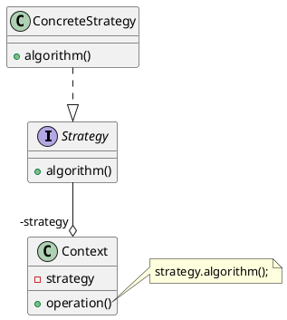

## Template method（模板方法）

意图:
> 定义一个操作中的算法的骨架，而将一些步骤延迟到子类中。模板方法使得子类可以不改变一个算法的结构即可重定义该算法的某些特定步骤。

PlantUML Code:

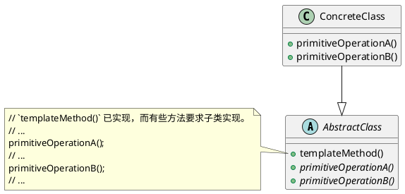

## Chain of responsibility（责任链）

意图:
> 避免请求发送者与接收者耦合在一起，让多个对象都有可能接收请求，将这些对象连接成一条链，并且沿着这条链传递请求，直到有对象处理它为止。

PlantUML Code:

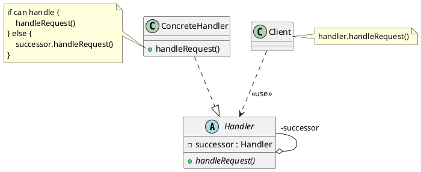

## Command（命令）

意图:
> 将一个请求封装成一个对象，从而使您可以用不同的请求对客户进行参数化。
>
> *请求最终会调用接收者具体实现的功能，而调用者只需调用设置好的请求即可。*

PlantUML Code:

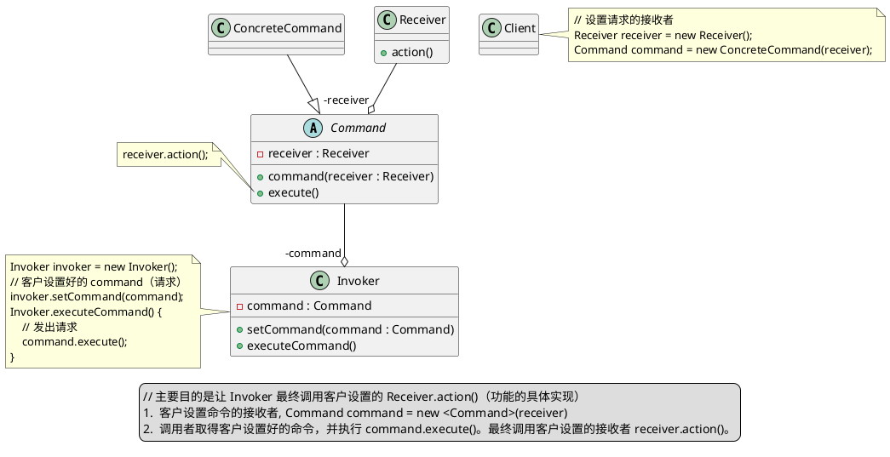

## Interpreter（解释器）

意图:
> 给定一个语言，定义它的文法表示，并定义一个解释器，这个解释器使用该标识来解释语言中的句子。

PlantUML Code:

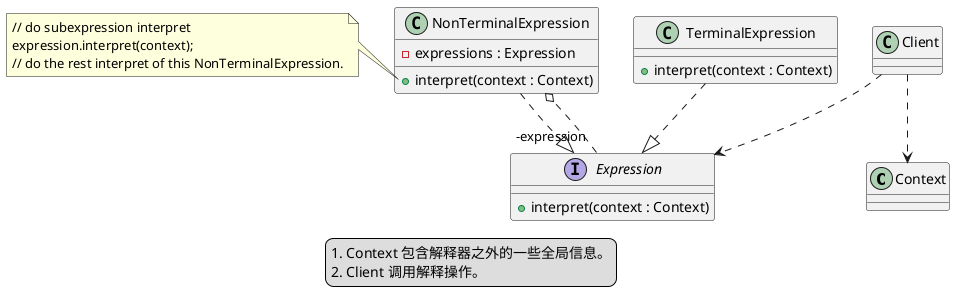

## Iterator（迭代器）

意图:
> 提供一种方法顺序访问一个聚合对象中各个元素, 而又无须暴露该对象的内部表示。

PlantUML Code:

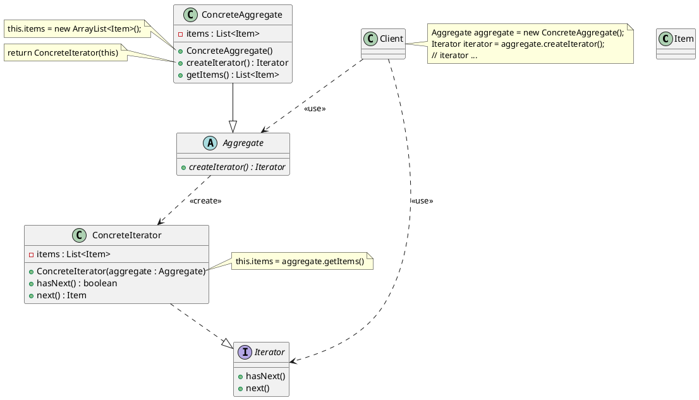

## Mediator（中介者）

意图:
> 用一个中介对象来封装一系列的对象交互，中介者使各对象不需要显式地相互引用，从而使其耦合松散，而且可以独立地改变它们之间的交互。
>
> Colleagues 都聚合 Mediator，Mediator 也都聚合 Colleagues 即可。这样 Colleagues 之间不用相互聚合。

PlantUML Code:

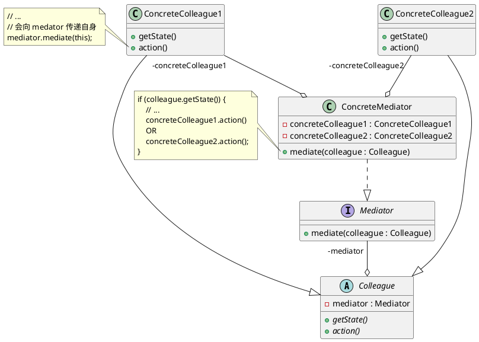

## Memento（备忘录）

意图:
> 在不破坏封装性的前提下，捕获一个对象的内部状态，并在该对象之外保存这个状态。

PlantUML Code:

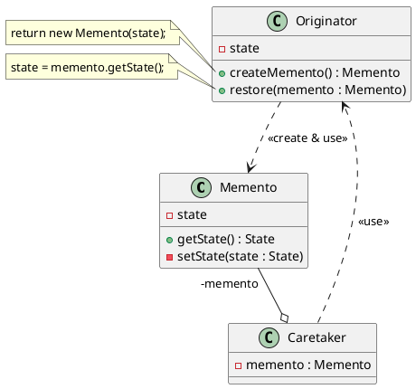

## Observer（观察者）

意图:
> 定义对象间的一种一对多的依赖关系，当一个对象的状态发生改变时，所有依赖于它的对象都得到通知并被自动更新。

PlantUML Code:

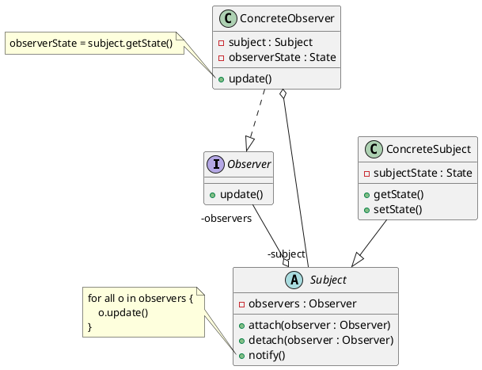

## State（状态）

意图:
> 让一个对象在其内部状态改变的时候，其行为也随之改变。状态模式需要对每一个系统可能获取的状态创立一个状态类的子类。当系统的状态变化时，系统便改变所选的子类。

PlantUML Code:

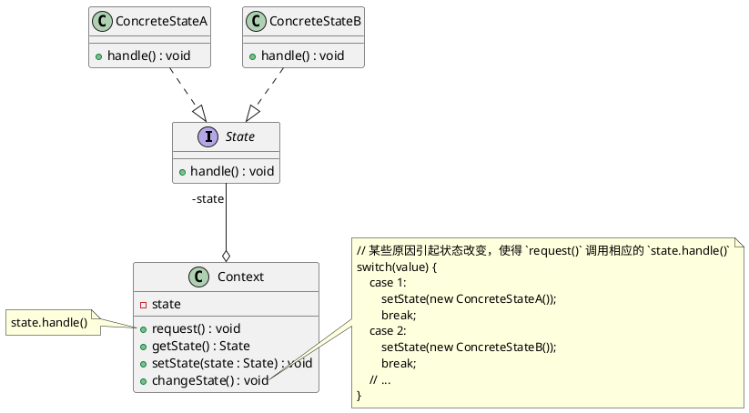

## Visitor（访问者）

意图:
> 主要将数据结构与数据操作分离。

PlantUML Code:

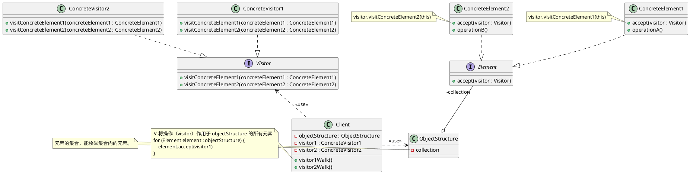
