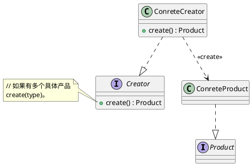
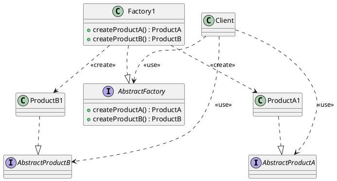
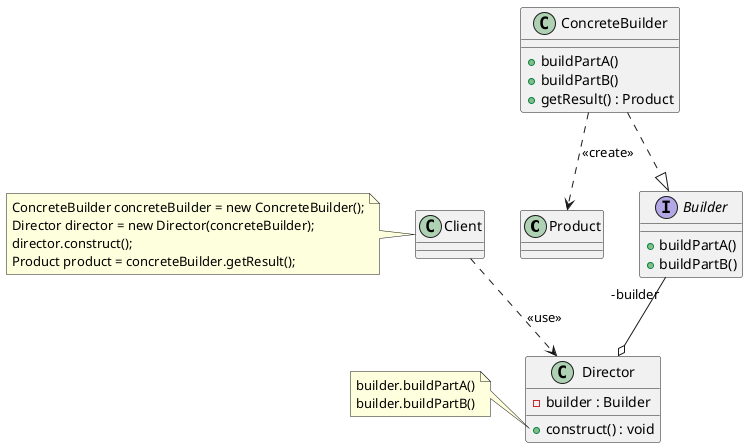
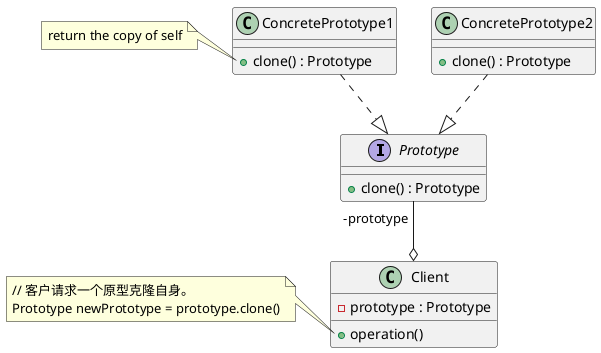
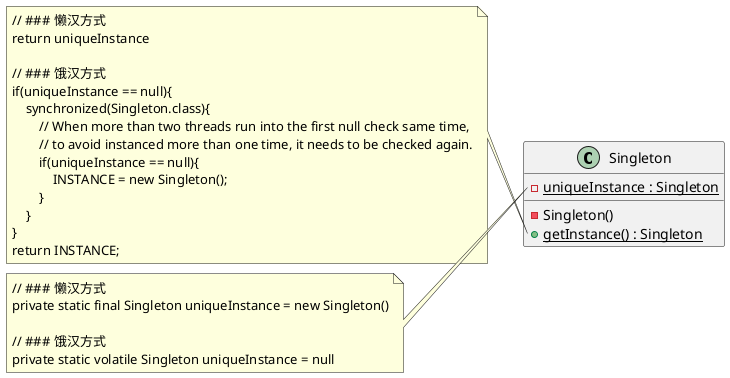

# Creational patterns（创建型模式）

创建型模式(Creational Pattern): 对类的实例化过程进行了抽象，能够将软件模块中对象的创建和对象的使用分离。

## Factory method（工厂方法）

意图:
> 定义一个创建对象的接口，让其子类自己决定实例化哪一个工厂类，工厂模式使其创建过程延迟到子类进行。

PlantUML Code:

### 例子

protobuf:
-   [`MessageFactory::GetPrototype`](https://github.com/protocolbuffers/protobuf/blob/main/src/google/protobuf/message.h) 让子类决定具体的创建。
-   [`DynamicMessageFactory::GetPrototype`](https://github.com/protocolbuffers/protobuf/blob/main/src/google/protobuf/dynamic_message.cc)

## Abstract factory（抽象工厂）

意图:
> 提供一个创建一系列相关或相互依赖对象的接口，而无需指定它们具体的类。

PlantUML Code:

### 例子

grpc ClientAsyncReaderFactory:

-   [channel_interface](https://github.com/grpc/grpc/blob/master/include/grpcpp/impl/channel_interface.h)
-   [async_stream.h](https://github.com/grpc/grpc/blob/master/include/grpcpp/support/async_stream.h)

## Builder（生成器）

意图:
> 将一个复杂的构建与其表示相分离，使得同样的构建过程可以创建不同的表示。

PlantUML Code:

### 例子

protobuf [`DescriptorBuilder::BuildFileImpl`](https://github.com/protocolbuffers/protobuf/blob/main/src/google/protobuf/descriptor.cc)

## Prototype（原型）

意图:
> 用原型实例指定创建对象的种类，并且通过拷贝这些原型创建新的对象。

PlantUML Code:

### 例子

C++ 可以通过复制/移动构造来灵活地实现原型模式。而一些以"引用"来指定绑定对象实例的语言则会提供 shallow copy 或 deep copy 来克隆一个实例。比如: rust, java, lua, python 等。

## Singleton（单件）

意图:
> 确保一个类只有一个实例，并提供对该实例的全局访问。

PlantUML Code:

[有两种方式实现](https://zh.wikipedia.org/wiki/%E5%8D%95%E4%BE%8B%E6%A8%A1%E5%BC%8F)

1.  懒汉方式。指全局的单例实例在第一次被使用时构建。
2.  饿汉方式。指全局的单例实例在类装载时构建。

[*C++和双重检查锁定模式(DCLP)的风险*](https://blog.csdn.net/linlin003/article/details/79012416)

> 因为 C/C++ 语言没有线程的概念，所以只用 C/C++ 通过双重检查锁定模式(DCLP)来实现线程安全的单例模式是不可能的。

### 例子

protobuf [`MessageFactory::generated_factory`](https://github.com/protocolbuffers/protobuf/blob/main/src/google/protobuf/message.h)
