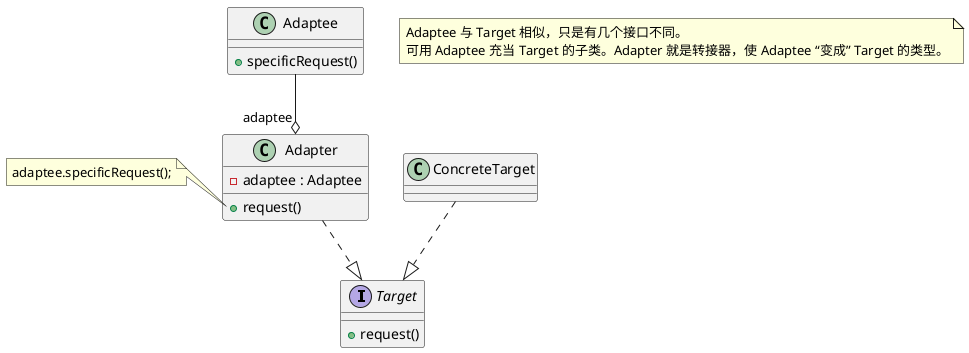
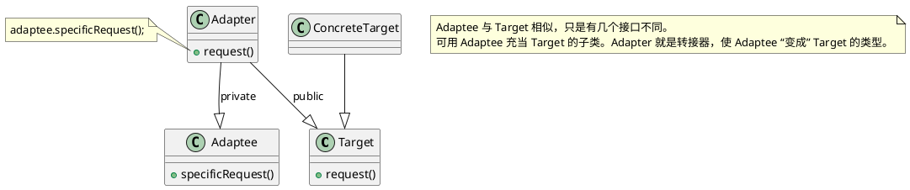
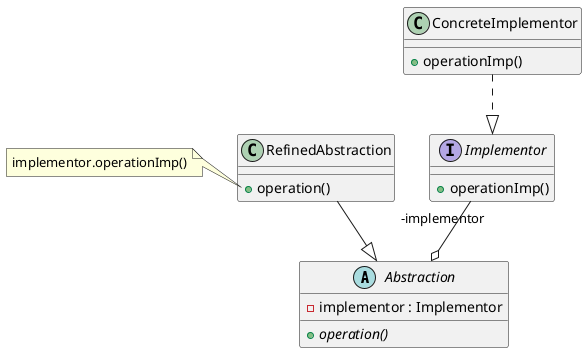
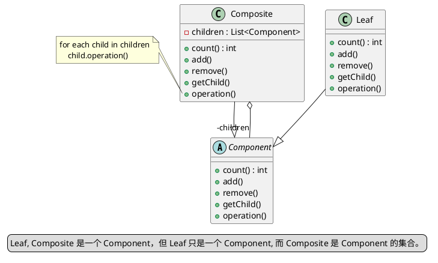
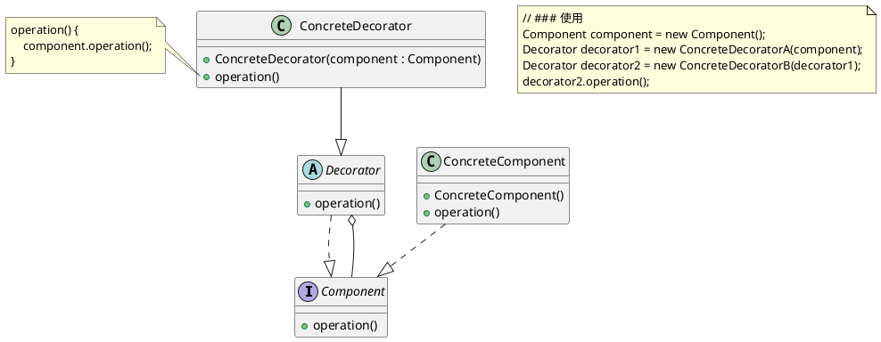
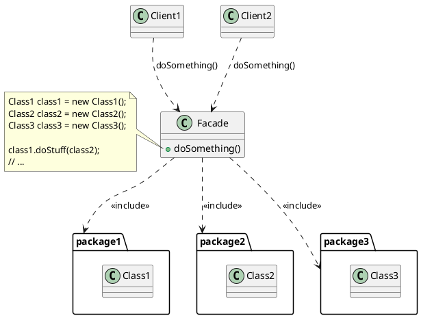
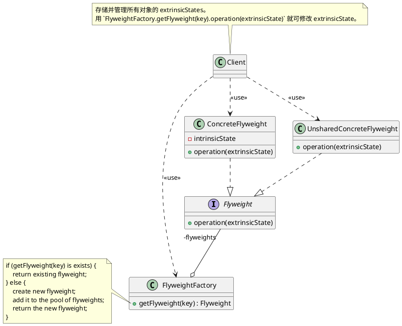
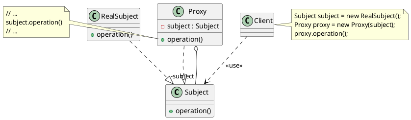

# Structural patterns（结构型模式）

结构型模式(Structural Pattern): 描述如何将类或者对象结合在一起形成更大的结构，就像搭积木，可以通过 简单积木的组合形成复杂的、功能更为强大的结构。

## Adapter（适配器）

意图:
> 将一个类的接口转换成客户希望的另外一个接口。适配器模式使得原本由于接口不兼容而不能一起工作的那些类可以一起工作。

#### Object adapter（对象适配器）

用组合的方法实现。

PlantUML Code:

#### Class adapter（类适配器）

用多继承的方法实现。

PlantUML Code:

## Bridge（桥接）

意图:
> 将抽象部分与实现部分分离，使它们都可以独立的变化。

PlantUML Code:

## Composite（组合）

意图:
> 将对象组合成树形结构以表示"部分-整体"的层次结构。组合模式使得用户对单个对象和组合对象的使用具有一致性。（一个结点或多个结点都可看作是一棵树）

PlantUML Code:

## Decorator（装饰）

意图:
> 动态地给一个对象添加一些额外的职责。就增加功能来说，装饰器模式相比生成子类更为灵活。

PlantUML Code:

## Facade（外观）

意图:
> 为子系统中的一组接口提供一个一致的界面，外观模式定义了一个高层接口，这个接口使得这一子系统更加容易使用。

PlantUML Code:

### 例子

常用的有实现和接口分离。`detail` namespace:
-   [async_simple](https://github.com/alibaba/async_simple/blob/main/async_simple/coro/Lazy.h)

## Flyweight（享元）

意图:
> 运用共享技术有效地支持大量细粒度的对象。

主要解决:
> 在有大量对象时，有可能会造成内存溢出，我们把其中共同的部分抽象出来，如果有相同的业务请求，直接返回在内存中已有的对象，避免重新创建。

PlantUML Code:

### 例子

protobuf 的 [`DynamicMessageFactory::GetPrototypeNoLock`](https://github.com/protocolbuffers/protobuf/blob/main/src/google/protobuf/dynamic_message.cc) 会先从对象池中查找, 如果找不到则生成, 然后加入对象池中。

## Proxy（代理）

意图:
> 为其他对象提供一种代理以控制对这个对象的访问。

PlantUML Code:

### 例子

-   cpp 的智能指针
